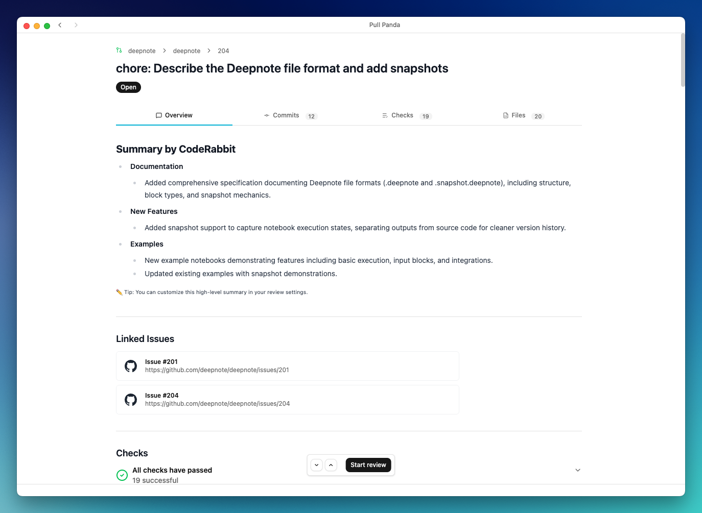

# SnapPR

[](https://opensource.org/licenses/MIT)

A delightful code review tool for the AI era.



## What is SnapPR?

SnapPR is a desktop app that makes reviewing GitHub pull requests faster and
more pleasant. In an era where AI is generating more code than ever, we believe
code review should be a smooth, focused experience rather than a chore.

- Authorize with your GitHub account
- See all PRs that need your attention in one place
- Review faster with a clean, modern interface

## Quick Start

Try SnapPR instantly without installing:

```bash
npx snappr
```

## Download

Or grab the latest release for your platform:

[**Download SnapPR**](../../releases/latest)

Available for Windows, macOS, and Linux.

## Built With

Electron, React, TypeScript, and Tailwind CSS. See
[CONTRIBUTING.md](CONTRIBUTING.md) if you're curious about the architecture.

## License

MIT - free to use, modify, and distribute.
