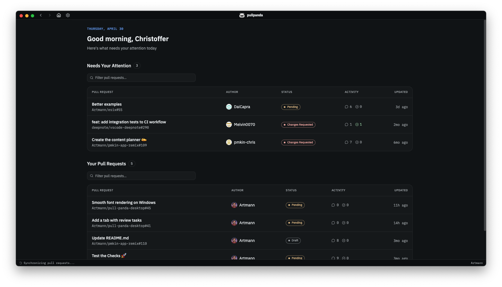
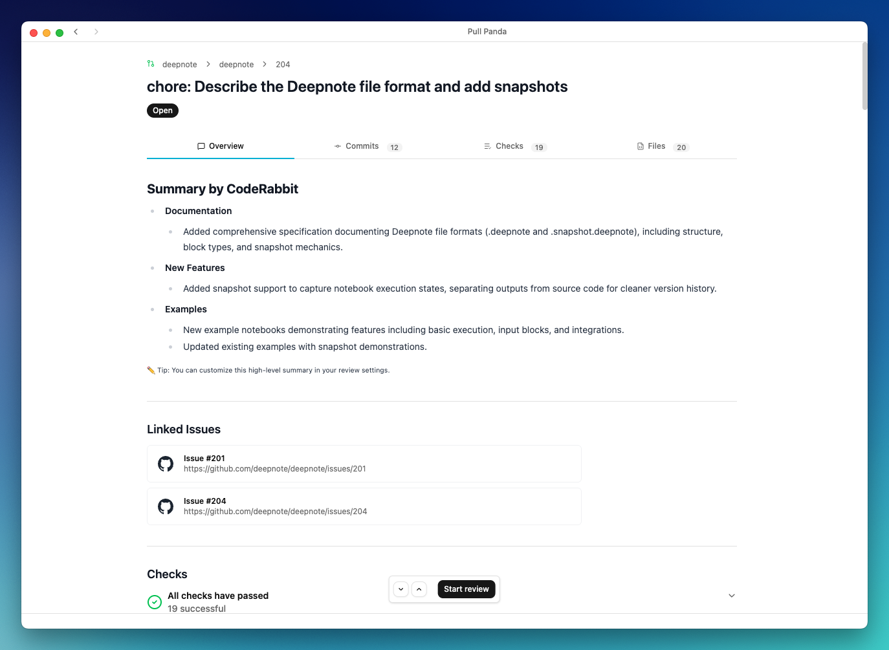
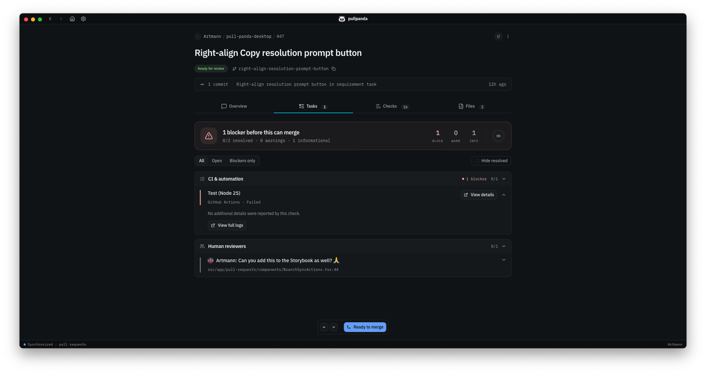
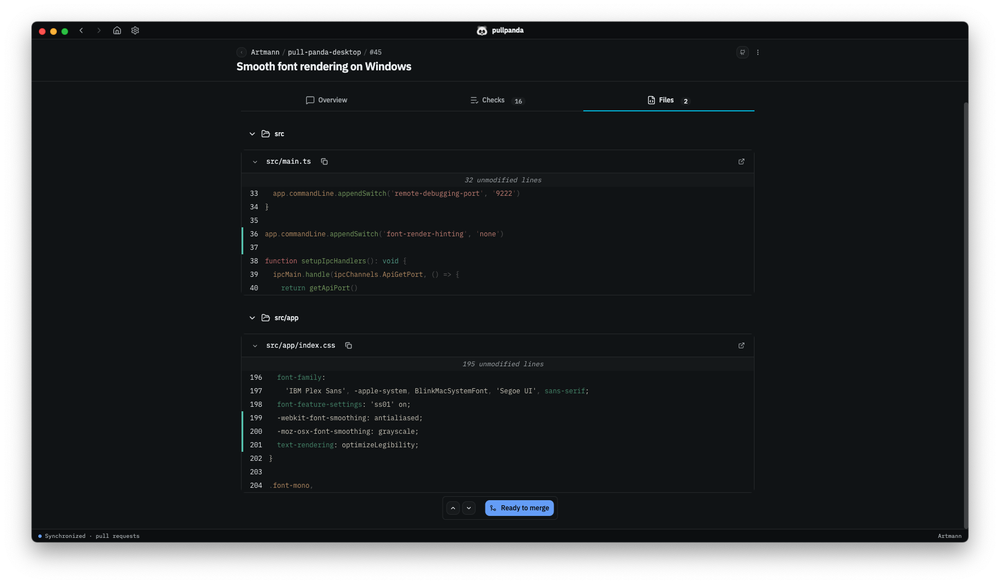
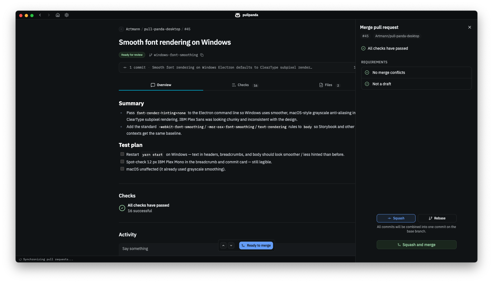
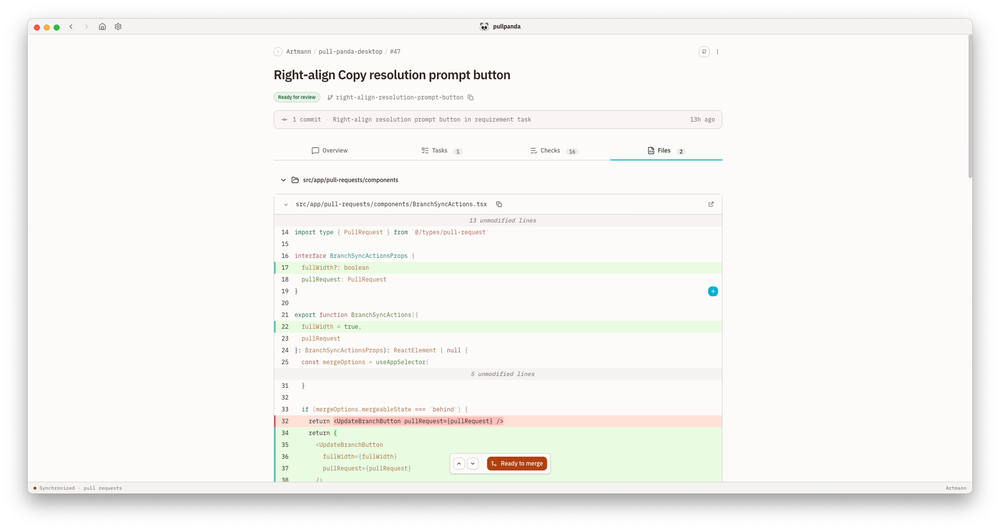
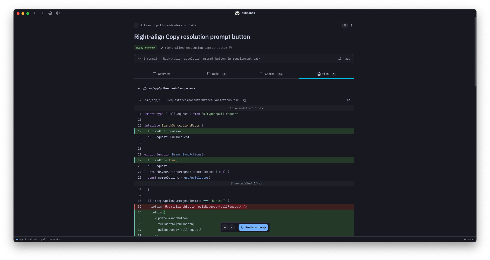

# Pull Panda

[](https://github.com/artmann/pull-panda-desktop/actions/workflows/ci.yml)
[](https://github.com/artmann/pull-panda-desktop/releases)
[](https://opensource.org/licenses/MIT)
[](https://deepwiki.com/Artmann/pull-panda-desktop)

A delightful way to review code.



## What is Pull Panda?

Pull Panda is a native desktop app for reviewing GitHub pull requests. You're
reviewing more code than ever — Pull Panda is built to make every review feel
calm, fast, and focused.

It sits on top of GitHub and uses your existing pull requests, so your team
keeps shipping the way they already do.

## Quick Start

Try Pull Panda instantly without installing:

```bash
npx pull-panda
```

Or grab the latest release for your platform:

[**Download Pull Panda**](../../releases/latest)

Available for Windows, macOS, and Linux.

## Features

### See what needs your attention at a glance

Skip the inbox triage. The dashboard puts the pull requests waiting on your
review at the top, so you always know what to look at next.


### Context first, conversation second

The activity feed is reorganized to put the summary, test plan, and check
status right where you want them — at the top.



### Every task, one view

The Tasks tab collects every blocker, warning, and request for change in one
place — so you never have to scroll through hundreds of comments and files to
find what needs to be done.



### Designed for reading code

The diff view is rebuilt from the ground up. Bigger fonts, calmer colors, and
just enough chrome to keep you in the code.



### Confident merges, every time

Review the requirements, take a final look at the checks, and ship — all from
one focused panel that stays out of your way until you need it.



### Bright as day, dark as night

| Light                                              | Dark                                             |
| -------------------------------------------------- | ------------------------------------------------ |
|  |  |

## Built With

Electron, React 19, TypeScript, Vite, Tailwind CSS 4, shadcn/ui, and SQLite via
Drizzle ORM. See [CONTRIBUTING.md](CONTRIBUTING.md) if you're curious about the
architecture.

## License

MIT — free to use, modify, and distribute.
